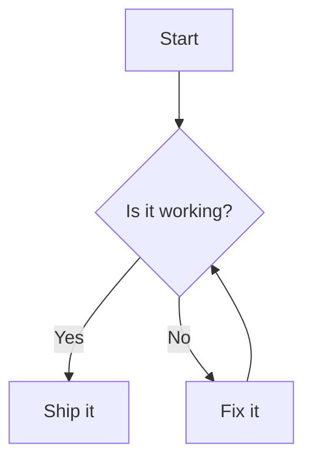
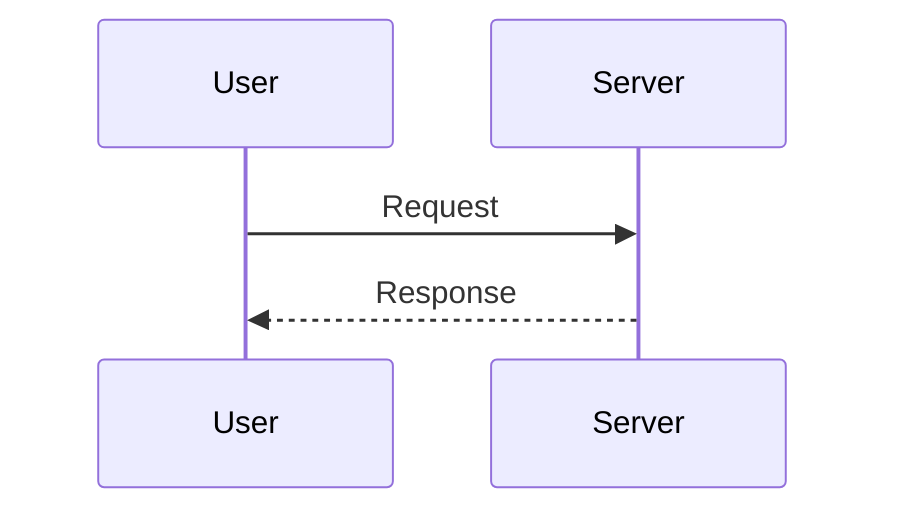
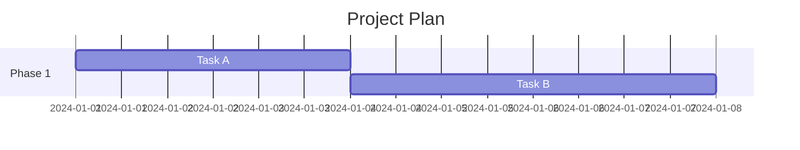

# Mermaid Diagrams in Narravo

Narravo supports authoring and rendering [Mermaid](https://mermaid.js.org/) diagrams directly inside the post editor.

## Writing a Diagram

Use a fenced code block with the `mermaid` language:

````markdown

````

When you paste or type a mermaid fenced block, the editor automatically converts it into an interactive Mermaid node with:

- Live preview (auto-renders after you pause typing)
- Raw diagram source retained for future edits
- Round‑trip markdown export back to the same fenced block form

## Inserting a Diagram Manually

Open the command palette (if implemented) or simply paste a ` ```mermaid ` fenced block. A custom node view appears with:

- A preview panel (SVG)
- A textarea containing the diagram source

## Security Model

- Diagrams are rendered client-side only.
- The stored content is plain text (diagram definition), not raw SVG.
- Mermaid is initialized with `securityLevel: 'strict'` to prevent script execution.

## Export / Import Behavior

- Exporting to markdown produces the original fenced mermaid block.
- Importing markdown with mermaid fences triggers an automatic conversion into the dedicated Mermaid node.

## Troubleshooting

| Issue | Cause | Fix |
|-------|-------|-----|
| Diagram does not render | Syntax error | Check console for Mermaid error; fix syntax. |
| SVG not updating | Still typing / debounce | Wait ~0.5s after typing stops. |
| Fenced block stays a code block | Extension not loaded | Ensure `MermaidNode` is in the editor extensions array. |

## Example Gallery

````markdown



````

## Known Limitations

- No inline diagram support (block only).
- Copying from preview copies the rendered SVG, not the source. Use the textarea to copy textual definition.

## Future Enhancements (Ideas)

- Toolbar button to insert starter diagram templates.
- Theme synchronization (light/dark) via Mermaid config.
- Error panel with clickable line references.

---
Happy diagramming! 🎨
