# Mermaid Tests

> Paste this whole file into your editor. It contains multiple Mermaid code fences.  
> Try toggling light/dark theme and varying container widths to spot layout issues.

## 1) Flowchart — Basics

```mermaid
flowchart LR
  A[Start] --> B{Auth?}
  B -- Yes --> C[Dashboard]
  B -- No  --> D[Login Form]
  C --> E[🍪 Cookies OK?]
  E -- "Missing/Expired" --> F[[Re-issue Token]]
  E -- "Valid" --> G((Done))
  D --> H[/Reset Password/]
  H --> D
```


### 1.1) Flowchart — Subgraphs, Links, Styling, Wrap


---

## 2) Sequence Diagram — Interactions


---

## 3) Class Diagram — Domain Model


---

## 4) State Diagram — App Lifecycle


---

## 5) Entity-Relationship (ER) Diagram


---

## 6) Gantt Chart — Release Plan


---

## 7) Pie Chart — Traffic Mix


---

## 8) Journey Diagram — UX Sentiment

```mermaid
journey
  title New User Onboarding
  section Landing
    See Pricing: 3: 🙂
    Read Docs: 4: 🙂
  section Signup
    Create Account: 2: 😐
    Email Verify: 1: 😖
  section First Run
    Import Data: 2: 😐
    See Value: 5: 🤩
```


---

## 9) Mindmap — Feature Ideas


---

## 10) Timeline — Notable Events


---

## 11) Quadrant Chart — Strategy
```mermaid
quadrantChart
  title Investment Priorities
  x-axis Low Effort --> High Effort
  y-axis Low Impact --> High Impact
  quadrant-1 "Quick Wins"
  quadrant-2 "Big Bets"
  quadrant-3 "Defer"
  quadrant-4 "Revisit"

  A(Autosave)       : 0.2, 0.7
  B(Import Wizard)  : 0.6, 0.9
  C(Theme Builder)  : 0.8, 0.6
  D(Offline Mode)   : 0.9, 0.3
```

---

## 12) Requirement Diagram — Spec Traceability


---

## 13) Git Graph — Branching Model


---

## 14) Flowchart — Stress Test (Wide, Nested, RTL)
```mermaid
flowchart RL
  subgraph Outer["🧪 Stress Container (RTL)"]
    direction RL
    subgraph InnerA["A"]
      A1["A1 very very long label that should wrap if htmlLabels are enabled"] --> A2["A2"]
    end
    subgraph InnerB["B"]
      B1["B1"] --- B2["B2"]:::hot
      B2 -->|edge with **markdown**| B3["B3"]
    end
    A2 == wrapped ==>> B1
  end

  classDef hot fill:#fee2e2,stroke:#ef4444,color:#7f1d1d,stroke-width:2px
```

---

## Notes & Tips
- If some diagrams fail to render, your Mermaid version may not support that diagram type.  
  Consider upgrading to **Mermaid v10+**.
- For security, some renderers disallow `click` callbacks or external links—use the static designs above if so.
- If your editor sanitizes HTML, `classDef`-based styling still works without raw HTML.

*End of test file.*
