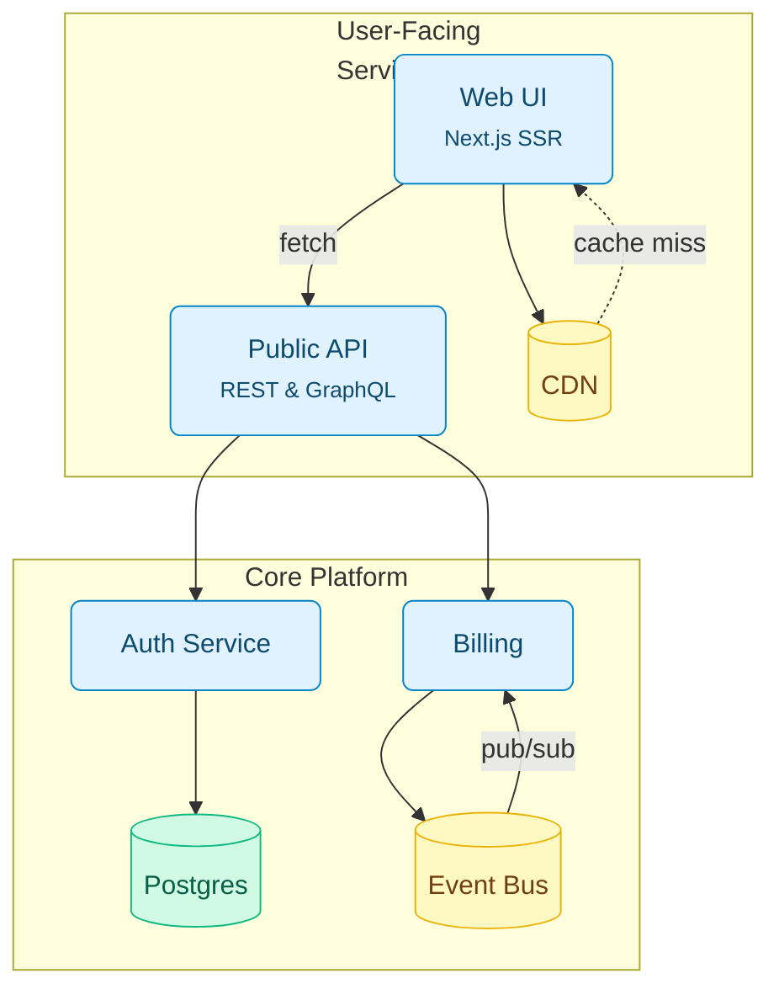

# Single Mermaid diagram

```mermaid
flowchart TD
  %% Long labels + line breaks via <br/>
  subgraph CLUSTER_1["User-Facing <br/> Services"]
    direction LR
    UI["Web UI<br/><small>Next.js SSR</small>"]:::svc
    API["Public API<br/><small>REST & GraphQL</small>"]:::svc
    CDN[(CDN)]:::infra
    UI -->|fetch| API
    UI --> CDN
  end

  subgraph CLUSTER_2["Core Platform"]
    direction TB
    SVC_A["Auth Service"]:::svc --> DB[(Postgres)]:::db
    SVC_B["Billing"]:::svc --> QUEUE[(Event Bus)]:::infra
    API --> SVC_A
    API --> SVC_B
  end

  click UI "https://example.com" "Open UI site"
  classDef svc fill:#e0f2fe,stroke:#0284c7,color:#0c4a6e,rx:6,ry:6
  classDef db fill:#d1fae5,stroke:#10b981,color:#065f46,rx:5,ry:5
  classDef infra fill:#fef9c3,stroke:#eab308,color:#713f12,rx:4,ry:4

  %% Edges with labels
  CDN -. cache miss .-> UI
  QUEUE -- "pub/sub" --> SVC_B
```

This is a single mermaid diagram that has a subgraph, with that it should appear as two diagram blocks with lines connecting them.